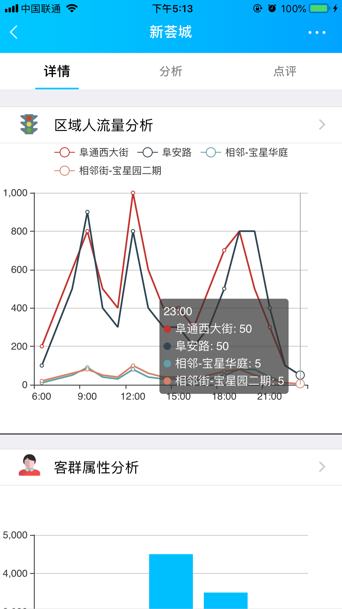
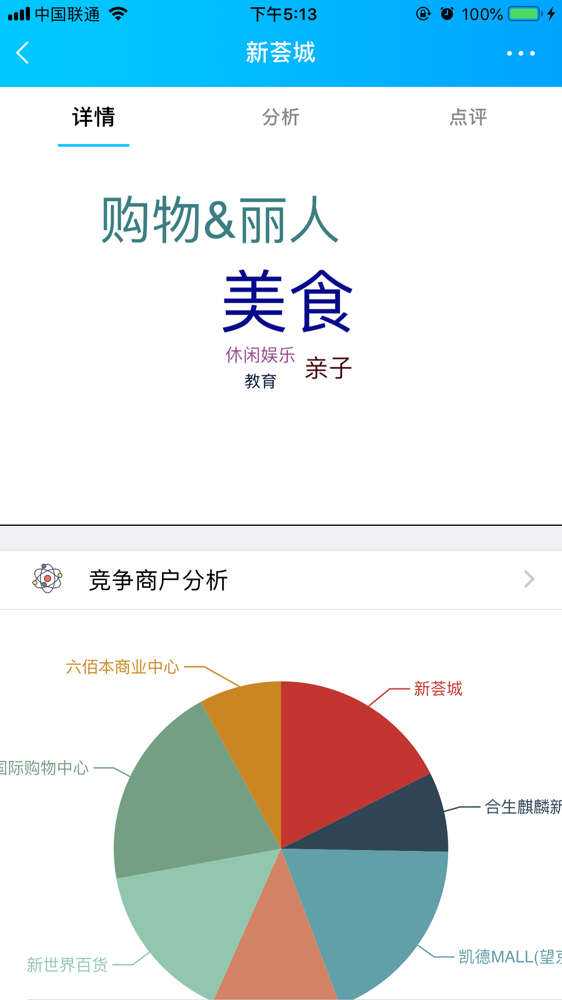

# smartGeo
惠经营,商户选址，项目实例

# 目的
通过最新的ios开发技术，结合开源代码，实现一个简单的示例Demo

* 商户新闻
* 商户搜索
* 商户详情
* 商户分析
* 商户评价

# 技术说明
* 多列表横向滑动滑动
* 列表滑动，图片缩放
* 列表，navigationbar关联滑动
* 详情，复杂列表展示
* html应用
* 仿朋友圈列表应用
* 百度地图应用

# 展示

# 关于
由于只是demo，为快速开发，本demo大量使用开源代码，尽请原谅。
